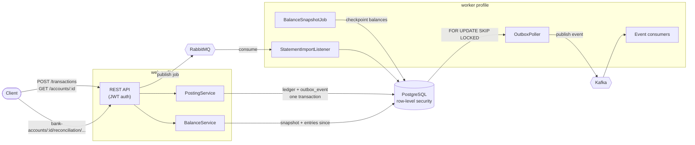

# LedgerFlow

[](https://github.com/labheshwar/ledgerflow/actions/workflows/ci.yml)

A double-entry bookkeeping engine — the same accounting model real banks and payment
processors use, where every transaction is recorded as a balanced pair of entries (a debit
somewhere and a matching credit somewhere else), so the books can never silently drift out of
balance. It's a single Spring Boot service built around one core invariant: **for any
transaction, the sum of its debits must equal the sum of its credits**, enforced in code
before anything is written to the database.

## Why this exists

Ledgers sit at the center of every payment platform, but most day-to-day backend work around
them (onboarding, terminals, payment orchestration) treats the ledger as a black box you write
to, not something you build yourself. LedgerFlow opens that box: it implements the four things
that make a ledger trustworthy under real-world conditions — balanced postings, safe retries,
a reconciliation process against an external source of truth, and a permanent audit trail.

## Core features

- **Balanced posting** — every transaction is submitted as a set of entries; the service
  rejects anything where debits and credits don't sum to zero, inside a single database
  transaction, so a failure midway never leaves a half-posted entry behind.
- **Idempotent by design** — every posting carries a client-supplied idempotency key. A
  retried request (client timeout, dropped connection) is recognized and returns the original
  result instead of posting twice — including the case where two requests with the same key
  race each other.
- **Balances are derived, never stored** — an account balance is the sum of its entries, read
  through periodic snapshots so the sum stays bounded as history grows. There is no balance
  column to drift from the entries that explain it, and posting no longer contends on the
  account row, so two people invoicing at once never collide.
- **Reconciliation workspace** — a two-pane view matches an imported statement's own lines
  against the ledger, one line at a time: fuzzy-scored candidates (an existing entry on the
  bank account, or an open invoice or bill it could settle), a one-click match, and a
  categorize action that posts a brand-new journal entry directly when neither exists. A
  partial unique index stops the same ledger entry from ever accounting for two different
  lines, the same guard shape the statement import's own dedupe already uses.
- **Money is a type, not a number** — amounts carry their currency, normalize to that
  currency's scale (two places for USD, none for JPY), and refuse to be added across
  currencies. Splitting is exact: five cents three ways is 2/2/1, never three parts that fail
  to add back up.
- **Accounting dates, not insert timestamps** — every transaction records the date it is
  effective for the books, separately from when the row was written, so a back-dated
  correction lands in the period it corrects.
- **Unbalanced journal entries are unconstructable** — the double-entry check lives in the
  constructor of the command itself, so there is no code path that can build one, pass it
  around, and discover the problem at commit time.
- **A real chart of accounts** — accounts are coded, nest under headings, and can be marked
  with a system role (`CASH`, `ACCOUNTS_RECEIVABLE`, …) that lets a feature find the right
  account without asking the user or matching on a name someone is free to rename. A heading
  cannot itself hold entries — giving an account a child automatically turns it into one — and
  the chart tree carries a roll-up balance for every heading, computed from what is beneath it.
  Accounts are archived, never deleted, once anything has been posted to them.
- **Concurrency safety** — every account carries an optimistic-lock version column, so two
  postings racing to update the same account can't silently clobber each other's balance.
- **Reversal, not deletion** — a posted transaction is never edited or deleted; it is reversed
  by a mirror entry with every direction swapped, linked back to the original by
  `reversal_of_transaction_id`. Whether a transaction has been reversed is derived by looking
  for one that points back at it, the same derived-not-stored principle balances already
  follow — there is no status flag on the original to fall out of sync. Reversing the same
  transaction twice returns the original reversal rather than posting a second one.
- **Accounting periods with database-enforced locking** — a period marks a date range closed
  to new postings. The check runs twice: once in the application, for a clear error message,
  and once as a `BEFORE INSERT` trigger in Postgres itself, so a raw SQL insert that bypasses
  the app entirely is still refused. Periods for one organization cannot overlap — enforced by
  a `gist` exclusion constraint, not a query the application has to remember to run first.
- **Year-end close** — zeroes every revenue and expense account as of a date and moves the net
  result to Retained Earnings in one balanced journal, derived entirely from account balances
  rather than tracked separately. Closing the same year twice returns the original closing
  journal instead of moving the same income into equity a second time.
- **Append-only audit trail** — every posting and reconciliation result appends a row to an
  audit log with before/after snapshots. Nothing is ever overwritten; the database itself
  rejects `UPDATE`/`DELETE` on that table.
- **Transactional outbox onto Kafka** — a posting and the event announcing it are written in
  one database transaction, and a separate poller moves events onto Kafka. Nothing can publish
  an event for a transaction that rolled back, or commit a transaction whose event was lost.
  The trace id of the request that caused the posting travels with the event.
- **Web and worker are the same image, different profiles** — the HTTP tier consumes no
  queues, drains no outbox and runs no scheduled jobs, so the two can be scaled on completely
  different signals.
- **Contacts, tax rates and items** — the reference data an invoice or bill will point at from
  the next milestone on: customers and vendors (a contact can be both), tax rates as a plain
  percentage, and a catalog of things sold or bought. Archived, never deleted, the moment
  anything else can reference one.
- **Gapless document numbering** — the next invoice or bill number is drawn with a single
  atomic `INSERT … ON CONFLICT … DO UPDATE … RETURNING`, one counter per organization per
  document type, never a Postgres `SEQUENCE`. A sequence advances even when the transaction
  that read it rolls back; this counter's increment shares whatever transaction is creating the
  document, so a number is never spent on something that never actually saved.
- **Invoices** — a draft is a plan, freely edited or deleted; sending one draws a document
  number and posts `DR Accounts Receivable / CR Sales Revenue / CR Tax Payable` as one balanced
  journal, computed by the same totals arithmetic the UI already showed live. From there it is
  history: undone only by voiding, which reverses the posting exactly like reversing any other
  transaction. Sending is split into two short, separately-committed steps around the posting
  call itself, so a crash between them cannot leave the ledger half-updated — a background
  sweeper finds and finishes anything left in that state, safely, because the posting step is
  idempotent.
- **Documents & delivery** — an invoice renders to a PDF from the same data its web view reads,
  emailed with that PDF attached and a link to view it online, no LedgerFlow account required.
  Emailing is a background job — MinIO holds the rendered document and any other attachment,
  MailHog catches every email this stack sends so nothing real ever leaves the machine, and the
  public link resolves through an unguessable token rather than a login: the token itself, 32
  random bytes, is the only thing standing between an anonymous request and one invoice.
- **Bills** — the mirror image of an invoice, entered against a vendor rather than a customer.
  A draft is freely edited or deleted; posting one draws this application's own document
  number and posts `DR each line's own expense or asset account / DR Tax Receivable / CR
  Accounts Payable` as one balanced journal — a bill line names whatever account it belongs to
  rather than assuming one revenue account the way invoicing does, since one bill can be rent,
  software and travel all at once. A duplicate-vendor-bill guard, a partial unique index on
  `(org_id, contact_id, vendor_reference)` that excludes voided rows, stops the same paper bill
  being keyed in twice while still letting a voided-and-corrected entry reuse its reference.
  Receipts attach the same way an invoice's documents do.
- **Payments settle several invoices or bills at once** — one payment carries an amount and a
  list of allocations, each naming an invoice or a bill and how much of the payment settles it.
  Received posts `DR Cash / CR Accounts Receivable`; paid posts `DR Accounts Payable / CR Cash`
  — and whatever the allocations don't add up to spending posts to the customer's or vendor's
  prepayment account instead, so money received or paid before it was earmarked for anything
  still lands somewhere real. An invoice's or a bill's `paid`/`balanceDue` is derived from every
  non-voided payment allocated against it, the same way `overdue` is derived, never stored;
  voiding a payment reverses its posting and reopens whatever it had settled.
- **Bank statement import, as a four-step wizard** — upload a CSV, map its own column names to
  date/description/amount/an optional reference, and a worker parses the whole file, computes
  every row's `external_id` (the mapped reference, or a hash of date/description/amount when
  the bank gives none) and stages only the rows that are not already committed for that bank
  account. A partial unique index on `(bank_account_id, external_id) WHERE committed`, the same
  guard shape bills' own duplicate-vendor-bill check uses, is what actually enforces the dedupe
  — the preview is a courtesy, not the only thing standing in the way. A committed line is
  descriptive until the reconciliation workspace above matches it against something real.
- **Foreign-currency invoices, with realized gain or loss posted automatically at
  settlement** — an invoice raised in EUR posts its receivable and revenue legs in EUR, at
  whatever rate is on file for its own issue date, frozen onto the entry the moment it posts.
  Settling it later, at a different rate, relieves that receivable at the exact rate it was
  booked at — not a fresh one — and the difference between that and the rate on the day it
  settles becomes a base-currency-only adjustment leg, debited or credited to Foreign Exchange
  Gain/Loss depending on which way the rate moved. The balance invariant that rejects an
  unbalanced journal at construction time can't do that here, since balancing a mixed-currency
  journal needs a rate lookup a plain value type has no access to — so for this one case it
  moves to `PostingExecutor`, inside the same database transaction as every entry it would
  write, rather than to the caller's leisure.

## Architecture


Three paths, and one process split in two.

The **synchronous** path is JWT-authenticated REST → service layer → JPA → PostgreSQL. The
**job** path hands work that should not block a caller to RabbitMQ, where a worker picks it up
with retry and dead-letter handling. The **event** path
is new and different in kind: a posting writes its event into an `outbox_event` row in the same
database transaction as the ledger change, and a poller moves those rows onto Kafka.

That distinction is the design: **RabbitMQ carries work, Kafka carries facts.** A job is
addressed to a worker, is consumed once and then is gone. An event is a statement about
something that happened, is retained, and can be read by consumers that don't exist yet or
replayed from the beginning to rebuild a read model. Using one broker for both means either
losing history or building a queue on top of a log.

The outbox is what makes the event path trustworthy. Writing to Postgres and then calling
`KafkaTemplate.send()` is a dual write: crash in between and the ledger and the event stream
disagree, with no way afterwards to tell which is right. Writing the event as a row makes "the
transaction happened" and "the event exists" one atomic fact, at the cost of at-least-once
delivery — a crash after a successful send but before the row is marked published will
republish it, so consumers deduplicate on `eventId`.

`PostingService.post()` retries on `OptimisticLockingFailureException`, and that only works if
every attempt gets its own transaction. A caller that wraps the call in one of its own marks
that whole transaction rollback-only on the first conflict, so every retry after it then fails
silently -- a bug that only shows up under real concurrent load, long after it shipped. `post()`
now refuses outright (`IllegalStateException`) if one is already active, and every document
service that posts (invoices today, bills and payments next) follows the same shape because of
it: persist the document's own row in a short transaction, call `post()` with none active, then
write the resulting transaction id back in a transaction of its own. A crash between those two
writes leaves the document referencing no transaction; each one's own background sweeper finds
and finishes it, safely, because the posting call in the middle is idempotent.

An account balance is not stored anywhere. It is the sum of that account's entries, computed
when asked: the newest snapshot at or before the date, plus every entry since. Snapshots keep
that sum bounded as history grows, and are purely an optimization -- with none, the sum simply
covers everything and returns the same answer. That is deliberate, because it means the
snapshot job can be late, fail, or be deleted and rebuilt without any reader being wrong.

The alternative, a stored running total, is what this replaced. It made every account a
contention point -- in a real business every invoice, payment and bill lands on the same few
accounts, so two people working at once collided on one row -- and it could silently disagree
with the entries that were supposed to explain it. It also could only ever answer "what is the
balance now", not "what was it on 31 March", which is the question every financial statement
actually asks.

Redis is still in the stack but currently caches nothing: the balance cache that used to live
there fronted a single-row lookup, and once that became a bounded aggregate it stopped being
worth an invalidation hook on every posting. It earns its place again with live updates and
report caching.

Both halves run the **same image**, told by Spring profile which half to be. `web` serves HTTP
and records outbox rows; `worker` drains the outbox, consumes queues and runs scheduled jobs.
Splitting them lets the HTTP tier scale on request latency and the worker on queue depth, and
means a slow reconciliation can never eat a thread that was going to serve a request. It also
contains privilege: the outbox poller needs an identity that can read every organization's
events, and only the worker process ever opens a connection with it.

JWT auth carries a role claim distinguishing `ADMIN` (can post, can match a statement line)
from `VIEWER` (read-only), and an `org` claim that scopes every query through PostgreSQL
row-level security.

**Stack**: Java 17, Spring Boot 3.5, PostgreSQL + Spring Data JPA, Flyway (versioned schema
migrations), Redis, RabbitMQ, Kafka (KRaft, no ZooKeeper), MinIO (S3-compatible object storage),
MailHog (a fake SMTP server for local development), openhtmltopdf, Apache Commons CSV,
Micrometer Tracing, JWT (jjwt), Docker Compose, JUnit + Mockito for unit tests, Testcontainers
for integration tests against real Postgres/Redis/RabbitMQ/Kafka/MinIO.

## Getting started

```bash
git clone https://github.com/labheshwar/ledgerflow.git
cd ledgerflow
cp .env.example .env
docker compose up -d --build
```

This brings up Postgres, Redis, RabbitMQ, Kafka, MinIO, MailHog, the API, the worker and the
web frontend, waits for each dependency to be healthy before starting the next, and applies the
Flyway migrations (including two seeded demo users and three demo accounts) on first boot. The
API is then available at `http://localhost:8080`, and the web UI at `http://localhost:8081`.
Every email this stack ever sends lands at MailHog's own UI, `http://localhost:8025` — nothing
it sends can reach a real inbox.

First boot is slow -- the worker deliberately waits for the API to be healthy before starting,
because the API owns the migrations and the worker validates its schema against them.

### Demo credentials

| Username | Password    | Role   |
|----------|-------------|--------|
| `admin`  | `admin123`  | ADMIN  |
| `viewer` | `viewer123` | VIEWER |

### Demo accounts

| ID | Code | Name                 | System role         |
|----|------|----------------------|----------------------|
| 1  | 1000 | Cash                 | `CASH`               |
| 2  | 1100 | Accounts Receivable  | `ACCOUNTS_RECEIVABLE`|
| 3  | 4000 | Revenue              | `SALES_REVENUE`      |
| 4  | 2000 | Accounts Payable     | `ACCOUNTS_PAYABLE`   |
| 5  | 3000 | Owner Equity         | `OWNER_EQUITY`       |
| 6  | 5000 | Operating Expenses   | —                    |

## API walkthrough

Log in and grab a token:

```bash
TOKEN=$(curl -s -X POST http://localhost:8080/auth/login \
  -H "Content-Type: application/json" \
  -d '{"username":"admin","password":"admin123"}' \
  | sed -E 's/.*"token":"([^"]+)".*/\1/')
```

Post a balanced transaction (debit Cash, credit Revenue):

```bash
curl -s -X POST http://localhost:8080/transactions \
  -H "Authorization: Bearer $TOKEN" -H "Content-Type: application/json" \
  -d '{
    "idempotencyKey": "demo-1",
    "description": "cash sale",
    "entries": [
      {"accountId": 1, "entryType": "DEBIT",  "amount": 100.00},
      {"accountId": 3, "entryType": "CREDIT", "amount": 100.00}
    ]
  }'
```

Retrying the exact same request (same `idempotencyKey`) returns the original transaction
instead of posting again. An unbalanced request (debits ≠ credits) gets a `400` instead.

Read the balance back (summed from the entries, through the latest snapshot):

```bash
curl -s http://localhost:8080/accounts/1/balance -H "Authorization: Bearer $TOKEN"
```

Read the whole chart as a tree, headings carrying the total of everything filed beneath them:

```bash
curl -s http://localhost:8080/accounts/tree -H "Authorization: Bearer $TOKEN"
```

Reverse a transaction (posts the mirror entry, dated today by default):

```bash
curl -s -X POST http://localhost:8080/transactions/1/reverse \
  -H "Authorization: Bearer $TOKEN" -H "Content-Type: application/json" \
  -d '{"reason": "entered against the wrong account"}'
```

Reversing the same transaction again returns the original reversal rather than posting a
second one. `GET /transactions/{id}` on either side of the pair reports the link:
`reversalOfTransactionId` on the reversal, `reversedByTransactionId` on the original.

Open and close an accounting period, then watch the database refuse a posting dated inside it:

```bash
curl -s -X POST http://localhost:8080/periods \
  -H "Authorization: Bearer $TOKEN" -H "Content-Type: application/json" \
  -d '{"startDate": "2026-01-01", "endDate": "2026-12-31"}'

curl -s -X POST http://localhost:8080/periods/1/close -H "Authorization: Bearer $TOKEN"

# Refused with code PERIOD_CLOSED -- txnDate falls inside the period just closed.
curl -s -X POST http://localhost:8080/transactions \
  -H "Authorization: Bearer $TOKEN" -H "Content-Type: application/json" \
  -d '{"idempotencyKey": "demo-2", "txnDate": "2026-06-15", "entries": [
    {"accountId": 1, "entryType": "DEBIT", "amount": 10.00},
    {"accountId": 3, "entryType": "CREDIT", "amount": 10.00}
  ]}'
```

Close the fiscal year — zeroes revenue and expense, moves the net to Retained Earnings:

```bash
curl -s -X POST http://localhost:8080/periods/close-year \
  -H "Authorization: Bearer $TOKEN" -H "Content-Type: application/json" \
  -d '{"asOfDate": "2026-12-31"}'
```

Calling it again for the same date returns the original closing journal — the same
idempotency-key lookup every other posting gets, so a retried close never double-counts
income into equity.

Set up a customer, a tax rate, and an item that references it:

```bash
curl -s -X POST http://localhost:8080/contacts \
  -H "Authorization: Bearer $TOKEN" -H "Content-Type: application/json" \
  -d '{"type": "CUSTOMER", "name": "Acme Widgets", "email": "billing@acme.test"}'

TAX_RATE_ID=$(curl -s -X POST http://localhost:8080/tax-rates \
  -H "Authorization: Bearer $TOKEN" -H "Content-Type: application/json" \
  -d '{"name": "Standard VAT", "rate": 15}' | sed -E 's/.*"id":([0-9]+).*/\1/')

curl -s -X POST http://localhost:8080/items \
  -H "Authorization: Bearer $TOKEN" -H "Content-Type: application/json" \
  -d '{"name": "Consulting hour", "defaultUnitPrice": 100.00, "defaultTaxRateId": '"$TAX_RATE_ID"'}'
```

Every list endpoint here (`/contacts`, `/tax-rates`, `/items`) follows the same paging, sorting
and search rules as `/accounts`, plus `includeArchived=true` to see what has been retired.
Reading them needs no role; creating, editing, archiving or deleting one needs `ADMIN`, exactly
like the chart of accounts.

Draft an invoice against that customer and item, then send it:

```bash
INVOICE_ID=$(curl -s -X POST http://localhost:8080/invoices \
  -H "Authorization: Bearer $TOKEN" -H "Content-Type: application/json" \
  -d '{
    "contactId": 1, "issueDate": "2026-09-21", "dueDate": "2026-10-21",
    "lines": [{"description": "Consulting hour", "quantity": 5, "unitPrice": 100.00, "taxRateId": '"$TAX_RATE_ID"'}]
  }' | sed -E 's/.*"id":([0-9]+).*/\1/')

curl -s -X POST http://localhost:8080/invoices/$INVOICE_ID/send -H "Authorization: Bearer $TOKEN"
```

The response carries the drawn `invoiceNumber` (`INV-00001`) and the `postedTransactionId` of
the journal it just became. A draft can be edited or deleted freely; once sent, neither works —
`INVOICE_NOT_EDITABLE` — and the only way to undo it is `POST /invoices/{id}/void`, which
reverses the posting exactly like reversing any other transaction and leaves the invoice `VOID`
rather than gone.

Once it's sent, get its PDF, share a public link, or email it (open `http://localhost:8025`
afterwards to see it land):

```bash
curl -s http://localhost:8080/invoices/$INVOICE_ID/pdf -H "Authorization: Bearer $TOKEN" -o invoice.pdf

curl -s -X POST http://localhost:8080/invoices/$INVOICE_ID/public-link -H "Authorization: Bearer $TOKEN"
# {"url":"http://localhost:5173/public/invoices/<token>"} -- open it in a private window; it needs no login

curl -s -X POST http://localhost:8080/invoices/$INVOICE_ID/email \
  -H "Authorization: Bearer $TOKEN" -H "Content-Type: application/json" \
  -d '{"recipientEmail": "customer@example.test"}'
```

The email call returns `202 Accepted` immediately — a worker renders the PDF and talks to SMTP
in the background, so a slow mail server never holds an HTTP thread. `POST
/invoices/{id}/remind` sends the same email with a reminder subject, meant for a `SENT` invoice
whose `overdue` is now `true`.

Attach a file to an invoice (a signed PO, a receipt -- anything, not just what LedgerFlow
generated itself):

```bash
curl -s -X POST http://localhost:8080/invoices/$INVOICE_ID/attachments \
  -H "Authorization: Bearer $TOKEN" -F "file=@receipt.pdf"
```

Enter a vendor bill and post it. `vendorReference` is the number printed on the vendor's own
bill, not one this application draws itself, and each line names the account it belongs to
rather than sharing one implied revenue account the way an invoice line does:

```bash
curl -s -X POST http://localhost:8080/contacts \
  -H "Authorization: Bearer $TOKEN" -H "Content-Type: application/json" \
  -d '{"type": "VENDOR", "name": "Acme Office Supply"}'

BILL_ID=$(curl -s -X POST http://localhost:8080/bills \
  -H "Authorization: Bearer $TOKEN" -H "Content-Type: application/json" \
  -d '{
    "contactId": 2, "vendorReference": "INV-4471", "billDate": "2026-09-21", "dueDate": "2026-10-21",
    "lines": [{"accountId": 9, "description": "Paper and toner", "quantity": 1, "unitPrice": 84.50}]
  }' | sed -E 's/.*"id":([0-9]+).*/\1/')

curl -s -X POST http://localhost:8080/bills/$BILL_ID/post -H "Authorization: Bearer $TOKEN"
```

The response carries the drawn `billNumber` (`BILL-00001`) and the `postedTransactionId` of the
journal it just became. A draft can be edited or deleted freely; once posted, neither works —
`BILL_NOT_EDITABLE` — and the only way to undo it is `POST /bills/{id}/void`, which reverses the
posting exactly like voiding an invoice does. Entering the same `(contactId, vendorReference)`
pair again, before that first bill is voided, is refused as `DUPLICATE_VENDOR_BILL` — the guard
that stops one paper bill from being keyed in twice. Attachments work exactly like an invoice's,
at `/bills/{id}/attachments`.

Record one payment that settles the invoice above and any others for the same customer in one
go -- `GET /payments/open-documents` is what a client would poll first to see what is left to
settle:

```bash
curl -s "http://localhost:8080/payments/open-documents?contactId=1&direction=RECEIVED" \
  -H "Authorization: Bearer $TOKEN"
# [{"documentType":"INVOICE","documentId":1,"number":"INV-00001","dueDate":"2026-10-21","balance":115.00}, ...]

curl -s -X POST http://localhost:8080/payments \
  -H "Authorization: Bearer $TOKEN" -H "Content-Type: application/json" \
  -d '{
    "contactId": 1, "direction": "RECEIVED", "paymentDate": "2026-09-21", "amount": 115.00,
    "allocations": [{"documentType": "INVOICE", "documentId": 1, "amount": 115.00}]
  }'
```

The invoice's own `GET /invoices/1` now shows `"paid": true, "balanceDue": 0.00`. Allocating
more than a payment's own amount is `OVER_ALLOCATED`; allocating more than one document's own
remaining balance is `ALLOCATION_EXCEEDS_BALANCE`, checked and refused before anything is
written, not after. `POST /payments/{id}/void` reverses the posting and reopens whatever it had
settled -- there is no edit, only voiding, the same rule invoices and bills already follow once
posted.

Record an exchange rate, raise an invoice in that currency, then settle it later at a
different rate and watch the realized gain or loss post on its own:

```bash
curl -s -X POST http://localhost:8080/fx-rates \
  -H "Authorization: Bearer $TOKEN" -H "Content-Type: application/json" \
  -d '{"currency": "EUR", "rate": 1.10, "asOfDate": "2026-09-01"}'

EUR_INVOICE_ID=$(curl -s -X POST http://localhost:8080/invoices \
  -H "Authorization: Bearer $TOKEN" -H "Content-Type: application/json" \
  -d '{
    "contactId": 1, "issueDate": "2026-09-01", "dueDate": "2026-10-01", "currency": "EUR",
    "lines": [{"description": "Consulting", "quantity": 1, "unitPrice": 100.00}]
  }' | sed -E 's/.*"id":([0-9]+).*/\1/')

curl -s -X POST http://localhost:8080/invoices/$EUR_INVOICE_ID/send -H "Authorization: Bearer $TOKEN"
# postedTransactionId's own entries: DR Accounts Receivable 100.00 EUR (baseAmount 110.00),
# CR Sales Revenue 100.00 EUR (baseAmount 110.00) -- the whole journal in EUR, at today's rate

curl -s -X POST http://localhost:8080/fx-rates \
  -H "Authorization: Bearer $TOKEN" -H "Content-Type: application/json" \
  -d '{"currency": "EUR", "rate": 1.05, "asOfDate": "2026-10-01"}'

curl -s -X POST http://localhost:8080/payments \
  -H "Authorization: Bearer $TOKEN" -H "Content-Type: application/json" \
  -d '{
    "contactId": 1, "direction": "RECEIVED", "paymentDate": "2026-10-01", "amount": 100.00,
    "allocations": [{"documentType": "INVOICE", "documentId": '"$EUR_INVOICE_ID"', "amount": 100.00}]
  }'
# this posting's own entries: DR Cash 100.00 EUR (base 105.00), CR Accounts Receivable
# 100.00 EUR (base 110.00, relieved at the invoice's OWN 1.10 rate, not today's 1.05) and a
# third leg -- DR Foreign Exchange Gain/Loss 5.00, base currency only, isFxAdjustment true --
# for the 5.00 the rate drop cost between the two dates
```

Recording the EUR rate again for the same date corrects it rather than adding a duplicate row.
Sending a foreign-currency invoice before any rate exists for its own currency is refused as
`MISSING_FX_RATE`; recording a rate for the organization's own base currency is refused as
`CANNOT_RATE_BASE_CURRENCY`, since that rate is always, trivially, 1.

Register a bank account against an existing Cash-type account, then walk a CSV statement
through the wizard -- upload, map, preview, commit:

```bash
BANK_ACCOUNT_ID=$(curl -s -X POST http://localhost:8080/bank-accounts \
  -H "Authorization: Bearer $TOKEN" -H "Content-Type: application/json" \
  -d '{"accountId": 1, "name": "Business Checking", "accountNumberLast4": "4321"}' \
  | sed -E 's/.*"id":([0-9]+).*/\1/')

IMPORT_ID=$(curl -s -X POST http://localhost:8080/bank-accounts/$BANK_ACCOUNT_ID/imports \
  -H "Authorization: Bearer $TOKEN" -F "file=@statement.csv" | sed -E 's/.*"importId":([0-9]+).*/\1/')
# {"importId": 1, "headers": ["Posted Date", "Details", "Amount", "Ref"]} -- the file's own header row

curl -s -X POST http://localhost:8080/bank-accounts/$BANK_ACCOUNT_ID/imports/$IMPORT_ID/preview \
  -H "Authorization: Bearer $TOKEN" -H "Content-Type: application/json" \
  -d '{"dateColumn": "Posted Date", "descriptionColumn": "Details", "amountColumn": "Amount", "externalIdColumn": "Ref"}'
# 202 Accepted -- a worker parses the whole file in the background

curl -s http://localhost:8080/bank-accounts/$BANK_ACCOUNT_ID/imports/$IMPORT_ID
# poll until "status":"PREVIEWED" -- totalRows/newRows/duplicateRows/errorRows and
# GET .../lines show what actually landed before anything is committed

curl -s -X POST http://localhost:8080/bank-accounts/$BANK_ACCOUNT_ID/imports/$IMPORT_ID/commit \
  -H "Authorization: Bearer $TOKEN"
```

Uploading the exact same file again previews the same rows as `duplicateRows`, not `newRows` --
the point of `external_id`, mapped from the bank's own reference column or, absent one,
computed from date/description/amount so a re-import of the same statement still dedupes.

Once a statement is committed, work through it in the reconciliation workspace -- suggestions
first, then a match:

```bash
curl -s "http://localhost:8080/bank-accounts/$BANK_ACCOUNT_ID/reconciliation/summary" \
  -H "Authorization: Bearer $TOKEN"
# {"totalLines":3,"matchedLines":0,"unmatchedLines":3}

LINE_ID=$(curl -s "http://localhost:8080/bank-accounts/$BANK_ACCOUNT_ID/reconciliation/lines?matched=false" \
  -H "Authorization: Bearer $TOKEN" | sed -E 's/.*"content":\[\{"id":([0-9]+).*/\1/')

curl -s "http://localhost:8080/bank-accounts/$BANK_ACCOUNT_ID/reconciliation/lines/$LINE_ID/suggestions" \
  -H "Authorization: Bearer $TOKEN"
# [{"kind":"INVOICE","id":1,"label":"INV-00001 — Acme Widgets","date":"2026-10-21",
#   "amount":115.00,"score":0.83}, ...] -- ENTRY, INVOICE or BILL, ranked highest first
```

A suggestion of kind `ENTRY` is matched directly:

```bash
curl -s -X POST "http://localhost:8080/bank-accounts/$BANK_ACCOUNT_ID/reconciliation/lines/$LINE_ID/match" \
  -H "Authorization: Bearer $TOKEN" -H "Content-Type: application/json" \
  -d '{"entryId": 42}'
```

A suggestion of kind `INVOICE` or `BILL` is settled instead -- this creates the payment that
pays it, scoped to this specific bank account rather than the organization's single Cash
account, so the entry it posts lands where it can be matched back:

```bash
curl -s -X POST "http://localhost:8080/bank-accounts/$BANK_ACCOUNT_ID/reconciliation/lines/$LINE_ID/settle" \
  -H "Authorization: Bearer $TOKEN" -H "Content-Type: application/json" \
  -d '{"documentType": "INVOICE", "documentId": 1}'
```

Nothing plausible on either side? Categorize it instead -- posts a new journal entry directly
between the bank account and whichever account it names (a bank fee, interest, anything else
that was never going to be an invoice or a bill):

```bash
curl -s -X POST "http://localhost:8080/bank-accounts/$BANK_ACCOUNT_ID/reconciliation/lines/$LINE_ID/categorize" \
  -H "Authorization: Bearer $TOKEN" -H "Content-Type: application/json" \
  -d '{"accountId": 6, "description": "Monthly service fee"}'
```

Any of the three sets the line's `matchedEntryId`; `POST .../unmatch` clears it again without
touching the entry that was posted -- unmatching breaks the link, not the posting, so a line
can be pointed at something else without ever double-posting.

### Organizations and tenant isolation

Every user signs in to one organization at a time, and all ledger data belongs to exactly one
organization. `POST /auth/signup` creates a user together with the organization they will
administer, and seeds it with a starter chart of accounts — a business with zero accounts
cannot record so much as someone putting money in, and asking a non-accountant to invent one
from nothing is asking them to get the system accounts wrong in ways that only surface once
invoicing can't find its receivables account. Every account it seeds can be renamed, recoded,
reparented or archived afterwards. `GET /auth/me` returns the current organization and any
others the user belongs to; `POST /auth/switch-org/{id}` re-issues a token for one of those.

The organization is a **signed claim inside the JWT**, not a header — the tenant a request acts
for must not be something the caller can change at will, so switching organizations means
getting a new token.

Isolation is enforced by Postgres, not by application code remembering to filter:

- Every tenant-scoped table carries `org_id` and has a row-level security policy.
- `OrgAwareJpaTransactionManager` publishes the tenant into the session
  (`set_config('app.current_org', …, true)`) as each transaction begins — on the exact
  connection that transaction will use, and transaction-scoped so nothing leaks back into the
  pool.
- The policy reads `current_setting('app.current_org', true)`, which yields NULL when unset.
  `org_id = NULL` is never true, so a request that fails to establish tenant context sees
  **zero rows rather than every row**.
- The application connects as `ledgerflow_app`, which is deliberately not a superuser. Flyway
  connects separately as the owning role. This split is load-bearing: superusers bypass RLS
  entirely, so an app running as the owner would make every policy decorative.
- `RlsPolicyVerifier` refuses to start if a tenant-scoped table is missing its policy, or has
  RLS enabled but not forced.

`RlsIntegrationTest` proves the behaviour against real Postgres: a cross-organization lookup
returns empty rather than denied — RLS filters rows out rather than raising, so the caller
cannot distinguish a row that never existed from one belonging to somebody else.

A public invoice link is the one deliberate exception, and it earns a paragraph of its own so
it reads as a decision rather than a gap. `GET /public/invoices/{token}` has no JWT and
therefore no tenant — and a request with no tenant sees nothing, by the fail-closed rule just
above. The token is resolved first, against `invoice_public_links`, a table that carries no
row-level security at all (see its own migration comment): it maps an unguessable 32-byte token
to nothing but the organization and invoice id it means. Once resolved, the rest of the request
runs inside `TenantContext.runAs` for that organization, so the actual invoice read goes through
the exact same policy-checked path any other read does. The token is the access control; RLS
still decides what it is allowed to see once resolved.

### Listing, paging and filtering

Every list endpoint (`/accounts`, `/transactions`, `/bank-accounts/:id/reconciliation/lines`,
`/audit-log`) is paged and returns the same envelope:

```json
{ "content": [], "page": 0, "size": 25, "totalElements": 0, "totalPages": 0 }
```

They accept `page`, `size` and `sort` (`sort=balance,desc`), plus per-resource filters — `q` for
a case-insensitive substring search, `type` on accounts, `entityType` on the audit log, and
`matched` (`true`/`false`, omit for both) on a bank account's own reconciliation lines:

```bash
curl -s "http://localhost:8080/accounts?type=ASSET&sort=balance,desc&size=5" \
  -H "Authorization: Bearer $TOKEN"
```

Sortable fields are whitelisted per endpoint; `?sort=` on anything else returns `400` with code
`INVALID_SORT` rather than quietly exposing an unindexed or unintended column.

### Errors

Error responses carry a stable, machine-readable `code` alongside the human-readable `message`:

```json
{ "timestamp": "...", "status": 400, "error": "Bad Request",
  "code": "UNBALANCED_TRANSACTION", "message": "..." }
```

Current codes: `UNBALANCED_TRANSACTION`, `ACCOUNT_NOT_FOUND`, `NOT_FOUND`, `INVALID_SORT`,
`INVALID_PARAMETER`, `VALIDATION_FAILED`, `INVALID_CREDENTIALS`, `UNAUTHENTICATED`, `FORBIDDEN`,
`INVALID_REQUEST`, `CURRENCY_MISMATCH`, `ACCOUNT_NOT_POSTABLE`,
`ACCOUNT_ARCHIVED`, `INTERNAL_ERROR`, plus the chart of accounts' own rules — `DUPLICATE_CODE`,
`INVALID_PARENT`, `ACCOUNT_IN_USE`, `SYSTEM_ACCOUNT`, `HAS_CHILDREN`, `MISSING_SYSTEM_ACCOUNT`,
`INVALID_CODE`, `INVALID_NAME`, `INVALID_TYPE`, periods/closing's own —
`PERIOD_CLOSED`, `OVERLAPPING_PERIOD`, `ALREADY_CLOSED`, `NOT_CLOSED`, `INVALID_PERIOD`,
`NOTHING_TO_CLOSE` — contacts/tax-rates/items' own — `INVALID_RATE`, `DUPLICATE_SKU`,
`INVALID_PRICE`, `INVALID_TAX_RATE` (`INVALID_NAME` and `INVALID_TYPE` above are shared with
these too) — invoices' own — `INVOICE_NOT_EDITABLE`, `INVOICE_NOT_VOIDABLE`,
`INVOICE_NOT_POSTED_YET`, `INVOICE_NOT_SENT_YET`, `NOTHING_TO_INVOICE`, `NO_LINES`,
`INVALID_LINE`, `INVALID_ITEM`, `INVALID_DUE_DATE`, `INVALID_DATE`, `CONTACT_NOT_A_CUSTOMER` —
and bills' own — `BILL_NOT_EDITABLE`, `BILL_NOT_VOIDABLE`, `BILL_NOT_POSTED_YET`,
`NOTHING_TO_BILL`, `DUPLICATE_VENDOR_BILL`, `CONTACT_NOT_A_VENDOR`, `INVALID_VENDOR_REFERENCE`
(`NO_LINES`, `INVALID_LINE`, `INVALID_ITEM`, `INVALID_TAX_RATE`, `INVALID_DUE_DATE` and
`INVALID_DATE` above are shared with bills too) — and payments' own — `OVER_ALLOCATED`,
`ALLOCATION_EXCEEDS_BALANCE`, `DOCUMENT_NOT_OPEN`, `WRONG_DOCUMENT_TYPE_FOR_DIRECTION`,
`CONTACT_MISMATCH`, `PAYMENT_NOT_VOIDABLE`, `PAYMENT_NOT_POSTED_YET`, `INVALID_AMOUNT`
(`CONTACT_NOT_A_CUSTOMER`, `CONTACT_NOT_A_VENDOR` and `INVALID_DATE` above are shared with
payments too) — the statement import wizard's own — `INVALID_MAPPING`, `EMPTY_FILE`,
`INVALID_CSV`, `IMPORT_ALREADY_PROCESSING`, `IMPORT_ALREADY_COMMITTED`, `IMPORT_NOT_PREVIEWED`
(`ACCOUNT_NOT_POSTABLE` and `ACCOUNT_ARCHIVED` above are reused, unchanged, for a bank account
pointed at a heading or an archived account) — and the reconciliation workspace's own —
`LINE_NOT_COMMITTED`, `LINE_ALREADY_MATCHED`, `LINE_NOT_MATCHED`, `ENTRY_WRONG_ACCOUNT`,
`ENTRY_ALREADY_MATCHED`, `AMOUNT_DIRECTION_MISMATCH`, `DOCUMENT_ALREADY_SETTLED`,
`BANK_ACCOUNT_NOT_FOUND` (also on `/payments`, once a payment is scoped to a bank account that
does not exist) — and exchange rates' own — `MISSING_FX_RATE`, `CANNOT_RATE_BASE_CURRENCY`,
`INVALID_CURRENCY` (also on `/invoices`, for an unrecognized currency code),
`MIXED_ALLOCATION_CURRENCIES`, `BANK_ACCOUNT_CURRENCY_UNSUPPORTED` (the last two on
`/payments`, once foreign-currency invoices are involved).

### Watching the event stream

Post a transaction, then read what the ledger announced about it:

```bash
docker compose exec kafka /opt/kafka/bin/kafka-console-consumer.sh \
  --bootstrap-server localhost:9092 \
  --topic ledger.transactions.v1 \
  --from-beginning --property print.headers=true
```

```
eventType:transaction.posted,orgId:1,sequence:14,traceparent:00-4bf92f3577b34da6a3ce929d0e0e4736-00f067aa0ba902b7-01
{"eventId":"7d1c...","eventType":"transaction.posted","schemaVersion":1,"orgId":1,
 "aggregateType":"TRANSACTION","aggregateId":"42","occurredAt":"2026-09-14T09:12:03.114Z",
 "payload":{"transactionId":42,"idempotencyKey":"inv-2026-0001","description":"Invoice 1001",
            "postedAt":"2026-09-14T09:12:03.101Z",
            "entries":[{"accountId":1,"accountName":"Cash","entryType":"DEBIT","amount":250.00},
                       {"accountId":3,"accountName":"Revenue","entryType":"CREDIT","amount":250.00}]}}
```

That `traceparent` is the trace id of the HTTP request that posted the transaction, carried
through the outbox row and onto the broker. The same id appears in the worker's log line when
it consumes the event — one trace across four processes.

The queue behind it is visible in the database:

```sql
-- what has not been published yet, and how far behind the poller is
SELECT count(*), min(now() - created_at) AS newest, max(now() - created_at) AS oldest
FROM outbox_event WHERE published_at IS NULL;

-- anything that has failed to publish
SELECT id, event_type, attempts, last_error FROM outbox_event WHERE attempts > 0;
```

A steadily growing unpublished count is the signal that the event path is broken, and it is
visible without touching Kafka at all — the outbox is the source of truth for what *should*
have been published.

Ordering is per organization: the partition key is `org-{orgId}`, so every event for one
business lands on one partition and is consumed in the order it was committed. Events for
different organizations are free to be processed in parallel.

### OpenAPI

The generated spec is at `/v3/api-docs` and Swagger UI at `/swagger-ui.html`, both unauthenticated
so you can read the contract before you have a token.

## Frontend

A Vue 3 + Vite + TypeScript single-page app in [`frontend/`](frontend), styled after the
original design mockups. It's a thin client over the API above — every page reads real data
from the endpoints already described (accounts, transactions, contacts, tax rates, items,
invoices, bills, payments, bank accounts, reconciliation, exchange rates, audit log) and
nothing is mocked. `ADMIN` sees posting/reconciliation/editing controls; `VIEWER` gets the
same pages read-only.

An invoice's own currency field defaults to blank (the organization's own base currency) and
takes any three-letter code; its detail page, and a transaction's own ledger slip, already
threaded amount + currency + a derived base amount through every figure before this milestone
existed, so a foreign-currency invoice or an FX adjustment leg (marked with a small `FX` pill)
renders correctly with no view-specific handling of its own.

One page needs neither: `/public/invoices/:token`, reached from an invoice's own "Copy public
link" action, renders outside the app shell entirely -- no sidebar, no login redirect, open to
whoever holds the link, signed in or not. It is the one route the router's auth guard
deliberately never touches.

In Docker, it's served by nginx at `http://localhost:8081`, with `/api/*` proxied to the `app`
service (no CORS configuration needed since the browser only ever talks to one origin). For
local development with hot reload against the backend from `docker compose`:

```bash
cd frontend
npm install
npm run dev
```

This opens on `http://localhost:5173`, with Vite's dev server proxying `/api/*` to
`http://localhost:8080` (see `vite.config.ts`). Log in with either demo account from the table
above.

## Running tests

```bash
mvn test          # unit tests only (JUnit + Mockito, no external dependencies)
mvn verify        # unit + integration tests (spins up real Postgres/Redis/RabbitMQ/Kafka via Testcontainers)
```

## Known limitations

This project is honest about where it's simplified, rather than hiding the gaps:

- **Traces are recorded but not exported** — spans exist and a `traceparent` propagates from
  an HTTP request through the outbox to a Kafka consumer, but nothing ships them to a
  collector yet, so there is no UI to look at a trace in.
- **Events are published, not yet consumed for anything** — the only consumer logs what it
  receives. Read models built from the stream come later.
- **Snapshots are not yet scheduled anywhere but the worker** — balance checkpoints are
  written by a monthly job. Nothing depends on them for correctness (a missing snapshot only
  costs time), but a large ledger that has never run the job will read balances by summing
  all of history.
- **Foreign currency reaches invoices and their settlement, not bills or a chosen bank
  account** — `Accounts Receivable`, `Sales Revenue`, `Tax Payable`, `Customer Prepayments` and
  `Cash` all accept a foreign-currency entry now; `Accounts Payable` and vendor-side accounts
  do not, so a bill is still always in the organization's own base currency. Settling a
  foreign invoice through a bank account scoped by the reconciliation workspace is refused
  outright (`BANK_ACCOUNT_CURRENCY_UNSUPPORTED`) rather than posted somewhere it cannot later
  be matched back to.
- **A payment cannot settle two different currencies at once** — every invoice allocated
  against one payment has to share a single currency, because there is one cash leg and it
  can only be denominated in one currency. Settling a EUR invoice and a GBP invoice needs two
  separate payments.
- **Exchange rates are entered by hand, not fetched from anywhere** — `POST /fx-rates` is the
  only source; there is no integration with a live rates feed, and a posting in a currency
  with no rate on file is refused (`MISSING_FX_RATE`) rather than guessed at.
- **Only two-decimal foreign currencies are meaningfully supported** — `InvoiceTotalsCalculator`
  always rounds to two decimal places regardless of which currency an invoice is actually in,
  the same simplification its own Javadoc already documented before milestone 15. A yen
  invoice would compute a total `Money` cannot represent and fail at send time.
- **Single-node Redis, RabbitMQ, Kafka and MinIO** — no HA or clustering for any of them, and
  the Kafka topic is created with replication factor 1. The outbox table is the durable record;
  Kafka is treated as transport that can be replayed into.
- **The invoice PDF and email are plain, on purpose** — one HTML template, no logo, no letterhead,
  a plain-text email body. Nothing here needed more than that to prove the pipeline (render,
  store, attach, deliver) actually works end to end; a real letterhead is a template change, not
  an architecture change.
- **Attachments have no size limit or content scanning** — anything a request can upload,
  today's `AttachmentService` stores. Fine for a local demo, not for a public-facing deployment.
- **A bill line's account is not validated until posting** — the same rule a manual journal
  entry already follows: an archived or heading account is rejected by `PostingService` when
  the bill is posted, not earlier when the line is saved as a draft.
- **A payment's own validation is not race-safe** — two payments allocated against the same
  invoice at the same moment can both read the same "remaining balance" and both pass, over-
  settling it in total even though each looked fine on its own. Real money at this scale would
  need `SELECT ... FOR UPDATE` or an equivalent lock across the read-then-write; skipped here as
  a demo-scale simplification, not because the race is not real.
- **Only the reconciliation workspace's own `settle` action can point a payment at a specific
  bank account** — recording one directly through `POST /payments` still always posts to the
  organization's single Cash account; the manual payment form was never wired up to offer a
  choice, since nothing needed it to until a statement line's own entry had to land on one
  particular account to be matchable back to it.
- **The computed fallback `external_id` can collide** — when a bank's own CSV carries no
  per-transaction reference, the fallback hash is date + description + amount; two genuinely
  different transactions sharing all three on the same day are indistinguishable to it, and the
  second is wrongly treated as a re-import of the first. A real per-transaction reference,
  mapped explicitly, does not have this problem.
- **Only ISO (`yyyy-MM-dd`) and US-style (`MM/dd/yyyy`) dates are recognized** — a statement in
  another format fails every one of its own rows as an error rather than being guessed at.
- **An uploaded statement has no size limit** — the same simplification `AttachmentService`
  already accepts for a receipt.
- **Matching a line is not race-safe** — the same class of gap a payment's own allocation
  already has: two requests matching the same still-unmatched line at the same moment can both
  pass validation before either writes back, though the database's own partial unique index on
  `matched_entry_id` still stops two lines from ever sharing one entry.
- **A crash between `settle` posting a payment and matching its line has no sweeper** — unlike
  an invoice, bill or payment's own two-halves posting, a statement line stuck unmatched after
  its payment actually posted has to be re-matched by hand; there is no background job looking
  for that particular gap, because the window is a single request rather than an asynchronous
  job with its own retry.
- **There is no way to dismiss a line that will never match anything** — every unmatched line
  is either matched, settled or categorized eventually; there is no "ignore" status for, say, a
  bank's own opening-balance line that reconciles against nothing.

These are the natural next steps, not oversights being hidden.

## License

[MIT](LICENSE)
