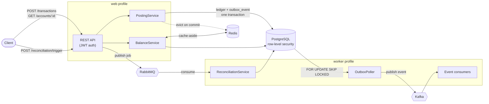

# LedgerFlow

[](https://github.com/labheshwar/ledgerflow/actions/workflows/ci.yml)

A double-entry bookkeeping engine — the same accounting model real banks and payment
processors use, where every transaction is recorded as a balanced pair of entries (a debit
somewhere and a matching credit somewhere else), so the books can never silently drift out of
balance. It's a single Spring Boot service built around one core invariant: **for any
transaction, the sum of its debits must equal the sum of its credits**, enforced in code
before anything is written to the database.

## Why this exists

Ledgers sit at the center of every payment platform, but most day-to-day backend work around
them (onboarding, terminals, payment orchestration) treats the ledger as a black box you write
to, not something you build yourself. LedgerFlow opens that box: it implements the four things
that make a ledger trustworthy under real-world conditions — balanced postings, safe retries,
a reconciliation process against an external source of truth, and a permanent audit trail.

## Core features

- **Balanced posting** — every transaction is submitted as a set of entries; the service
  rejects anything where debits and credits don't sum to zero, inside a single database
  transaction, so a failure midway never leaves a half-posted entry behind.
- **Idempotent by design** — every posting carries a client-supplied idempotency key. A
  retried request (client timeout, dropped connection) is recognized and returns the original
  result instead of posting twice — including the case where two requests with the same key
  race each other.
- **Cached balance reads** — account balances are cached in Redis (cache-aside), invalidated
  the instant a posting touches that account, so the fast read path never risks serving stale
  data.
- **Asynchronous reconciliation** — triggering a reconciliation queues a message on RabbitMQ
  and returns immediately; a separate worker compares the ledger against a simulated external
  statement feed, records per-account matches/mismatches, and marks the batch complete or
  failed, with retry and dead-letter handling if the worker dies mid-run.
- **Money is a type, not a number** — amounts carry their currency, normalize to that
  currency's scale (two places for USD, none for JPY), and refuse to be added across
  currencies. Splitting is exact: five cents three ways is 2/2/1, never three parts that fail
  to add back up.
- **Accounting dates, not insert timestamps** — every transaction records the date it is
  effective for the books, separately from when the row was written, so a back-dated
  correction lands in the period it corrects.
- **Unbalanced journal entries are unconstructable** — the double-entry check lives in the
  constructor of the command itself, so there is no code path that can build one, pass it
  around, and discover the problem at commit time.
- **Concurrency safety** — every account carries an optimistic-lock version column, so two
  postings racing to update the same account can't silently clobber each other's balance.
- **Append-only audit trail** — every posting and reconciliation result appends a row to an
  audit log with before/after snapshots. Nothing is ever overwritten; the database itself
  rejects `UPDATE`/`DELETE` on that table.
- **Transactional outbox onto Kafka** — a posting and the event announcing it are written in
  one database transaction, and a separate poller moves events onto Kafka. Nothing can publish
  an event for a transaction that rolled back, or commit a transaction whose event was lost.
  The trace id of the request that caused the posting travels with the event.
- **Web and worker are the same image, different profiles** — the HTTP tier consumes no
  queues, drains no outbox and runs no scheduled jobs, so the two can be scaled on completely
  different signals.

## Architecture


Three paths, and one process split in two.

The **synchronous** path is JWT-authenticated REST → service layer → JPA → PostgreSQL, with
Redis alongside for balance caching. The **job** path hands work that shouldn't block a caller
to RabbitMQ, where a worker picks it up with retry and dead-letter handling. The **event** path
is new and different in kind: a posting writes its event into an `outbox_event` row in the same
database transaction as the ledger change, and a poller moves those rows onto Kafka.

That distinction is the design: **RabbitMQ carries work, Kafka carries facts.** A job is
addressed to a worker, is consumed once and then is gone. An event is a statement about
something that happened, is retained, and can be read by consumers that don't exist yet or
replayed from the beginning to rebuild a read model. Using one broker for both means either
losing history or building a queue on top of a log.

The outbox is what makes the event path trustworthy. Writing to Postgres and then calling
`KafkaTemplate.send()` is a dual write: crash in between and the ledger and the event stream
disagree, with no way afterwards to tell which is right. Writing the event as a row makes "the
transaction happened" and "the event exists" one atomic fact, at the cost of at-least-once
delivery — a crash after a successful send but before the row is marked published will
republish it, so consumers deduplicate on `eventId`.

Both halves run the **same image**, told by Spring profile which half to be. `web` serves HTTP
and records outbox rows; `worker` drains the outbox, consumes queues and runs scheduled jobs.
Splitting them lets the HTTP tier scale on request latency and the worker on queue depth, and
means a slow reconciliation can never eat a thread that was going to serve a request. It also
contains privilege: the outbox poller needs an identity that can read every organization's
events, and only the worker process ever opens a connection with it.

JWT auth carries a role claim distinguishing `ADMIN` (can post, can trigger reconciliation)
from `VIEWER` (read-only), and an `org` claim that scopes every query through PostgreSQL
row-level security.

**Stack**: Java 17, Spring Boot 3.5, PostgreSQL + Spring Data JPA, Flyway (versioned schema
migrations), Redis, RabbitMQ, Kafka (KRaft, no ZooKeeper), Micrometer Tracing, JWT (jjwt),
Docker Compose, JUnit + Mockito for unit tests, Testcontainers for integration tests against
real Postgres/Redis/RabbitMQ/Kafka.

## Getting started

```bash
git clone https://github.com/labheshwar/ledgerflow.git
cd ledgerflow
cp .env.example .env
docker compose up -d --build
```

This brings up Postgres, Redis, RabbitMQ, Kafka, the API, the worker and the web frontend,
waits for each dependency to be healthy before starting the next, and applies the Flyway
migrations (including two seeded demo users and three demo accounts) on first boot. The API is
then available at `http://localhost:8080`, and the web UI at `http://localhost:8081`.

First boot is slow -- the worker deliberately waits for the API to be healthy before starting,
because the API owns the migrations and the worker validates its schema against them.

### Demo credentials

| Username | Password    | Role   |
|----------|-------------|--------|
| `admin`  | `admin123`  | ADMIN  |
| `viewer` | `viewer123` | VIEWER |

### Demo accounts

| ID | Name                 |
|----|----------------------|
| 1  | Cash                 |
| 2  | Accounts Receivable  |
| 3  | Revenue              |

## API walkthrough

Log in and grab a token:

```bash
TOKEN=$(curl -s -X POST http://localhost:8080/auth/login \
  -H "Content-Type: application/json" \
  -d '{"username":"admin","password":"admin123"}' \
  | sed -E 's/.*"token":"([^"]+)".*/\1/')
```

Post a balanced transaction (debit Cash, credit Revenue):

```bash
curl -s -X POST http://localhost:8080/transactions \
  -H "Authorization: Bearer $TOKEN" -H "Content-Type: application/json" \
  -d '{
    "idempotencyKey": "demo-1",
    "description": "cash sale",
    "entries": [
      {"accountId": 1, "entryType": "DEBIT",  "amount": 100.00},
      {"accountId": 3, "entryType": "CREDIT", "amount": 100.00}
    ]
  }'
```

Retrying the exact same request (same `idempotencyKey`) returns the original transaction
instead of posting again. An unbalanced request (debits ≠ credits) gets a `400` instead.

Read the balance back (served from Redis after the first read):

```bash
curl -s http://localhost:8080/accounts/1/balance -H "Authorization: Bearer $TOKEN"
```

Trigger a reconciliation and check its status once it completes:

```bash
BATCH_ID=$(curl -s -X POST http://localhost:8080/reconciliation/trigger \
  -H "Authorization: Bearer $TOKEN" | sed -E 's/.*"id":([0-9]+).*/\1/')

curl -s http://localhost:8080/reconciliation/$BATCH_ID -H "Authorization: Bearer $TOKEN"
```

The trigger call returns immediately (`202 Accepted`, status `PENDING`); the batch flips to
`COMPLETED` shortly after, once the reconciliation worker has consumed the message and recorded
a `MATCHED`/`MISMATCHED` result per account.

### Organizations and tenant isolation

Every user signs in to one organization at a time, and all ledger data belongs to exactly one
organization. `POST /auth/signup` creates a user together with the organization they will
administer; `GET /auth/me` returns the current organization and any others the user belongs to;
`POST /auth/switch-org/{id}` re-issues a token for one of those.

The organization is a **signed claim inside the JWT**, not a header — the tenant a request acts
for must not be something the caller can change at will, so switching organizations means
getting a new token.

Isolation is enforced by Postgres, not by application code remembering to filter:

- Every tenant-scoped table carries `org_id` and has a row-level security policy.
- `OrgAwareJpaTransactionManager` publishes the tenant into the session
  (`set_config('app.current_org', …, true)`) as each transaction begins — on the exact
  connection that transaction will use, and transaction-scoped so nothing leaks back into the
  pool.
- The policy reads `current_setting('app.current_org', true)`, which yields NULL when unset.
  `org_id = NULL` is never true, so a request that fails to establish tenant context sees
  **zero rows rather than every row**.
- The application connects as `ledgerflow_app`, which is deliberately not a superuser. Flyway
  connects separately as the owning role. This split is load-bearing: superusers bypass RLS
  entirely, so an app running as the owner would make every policy decorative.
- `RlsPolicyVerifier` refuses to start if a tenant-scoped table is missing its policy, or has
  RLS enabled but not forced.

`RlsIntegrationTest` proves the behaviour against real Postgres: a cross-organization lookup
returns empty rather than denied — RLS filters rows out rather than raising, so the caller
cannot distinguish a row that never existed from one belonging to somebody else.

### Listing, paging and filtering

Every list endpoint (`/accounts`, `/transactions`, `/reconciliation`, `/audit-log`) is paged and
returns the same envelope:

```json
{ "content": [], "page": 0, "size": 25, "totalElements": 0, "totalPages": 0 }
```

They accept `page`, `size` and `sort` (`sort=balance,desc`), plus per-resource filters — `q` for
a case-insensitive substring search, and `type` on accounts, `entityType` on the audit log,
`status` on reconciliation:

```bash
curl -s "http://localhost:8080/accounts?type=ASSET&sort=balance,desc&size=5" \
  -H "Authorization: Bearer $TOKEN"
```

Sortable fields are whitelisted per endpoint; `?sort=` on anything else returns `400` with code
`INVALID_SORT` rather than quietly exposing an unindexed or unintended column.

### Errors

Error responses carry a stable, machine-readable `code` alongside the human-readable `message`:

```json
{ "timestamp": "...", "status": 400, "error": "Bad Request",
  "code": "UNBALANCED_TRANSACTION", "message": "..." }
```

Current codes: `UNBALANCED_TRANSACTION`, `ACCOUNT_NOT_FOUND`, `NOT_FOUND`, `INVALID_SORT`,
`INVALID_PARAMETER`, `VALIDATION_FAILED`, `INVALID_CREDENTIALS`, `UNAUTHENTICATED`, `FORBIDDEN`,
`INTERNAL_ERROR`.

### Watching the event stream

Post a transaction, then read what the ledger announced about it:

```bash
docker compose exec kafka /opt/kafka/bin/kafka-console-consumer.sh \
  --bootstrap-server localhost:9092 \
  --topic ledger.transactions.v1 \
  --from-beginning --property print.headers=true
```

```
eventType:transaction.posted,orgId:1,sequence:14,traceparent:00-4bf92f3577b34da6a3ce929d0e0e4736-00f067aa0ba902b7-01
{"eventId":"7d1c...","eventType":"transaction.posted","schemaVersion":1,"orgId":1,
 "aggregateType":"TRANSACTION","aggregateId":"42","occurredAt":"2026-09-14T09:12:03.114Z",
 "payload":{"transactionId":42,"idempotencyKey":"inv-2026-0001","description":"Invoice 1001",
            "postedAt":"2026-09-14T09:12:03.101Z",
            "entries":[{"accountId":1,"accountName":"Cash","entryType":"DEBIT","amount":250.00},
                       {"accountId":3,"accountName":"Revenue","entryType":"CREDIT","amount":250.00}]}}
```

That `traceparent` is the trace id of the HTTP request that posted the transaction, carried
through the outbox row and onto the broker. The same id appears in the worker's log line when
it consumes the event — one trace across four processes.

The queue behind it is visible in the database:

```sql
-- what has not been published yet, and how far behind the poller is
SELECT count(*), min(now() - created_at) AS newest, max(now() - created_at) AS oldest
FROM outbox_event WHERE published_at IS NULL;

-- anything that has failed to publish
SELECT id, event_type, attempts, last_error FROM outbox_event WHERE attempts > 0;
```

A steadily growing unpublished count is the signal that the event path is broken, and it is
visible without touching Kafka at all — the outbox is the source of truth for what *should*
have been published.

Ordering is per organization: the partition key is `org-{orgId}`, so every event for one
business lands on one partition and is consumed in the order it was committed. Events for
different organizations are free to be processed in parallel.

### OpenAPI

The generated spec is at `/v3/api-docs` and Swagger UI at `/swagger-ui.html`, both unauthenticated
so you can read the contract before you have a token.

## Frontend

A Vue 3 + Vite + TypeScript single-page app in [`frontend/`](frontend), styled after the
original design mockups. It's a thin client over the API above — every page reads real data
from the endpoints already described (accounts, transactions, reconciliation, audit log) and
nothing is mocked. `ADMIN` sees posting/reconciliation controls; `VIEWER` gets the same pages
read-only.

Deliberately left out, matching gaps in the API itself: transaction reversal, CSV export, and
per-discrepancy resolution — the reconciliation model here compares whole account balances, not
individual bank-line items.

In Docker, it's served by nginx at `http://localhost:8081`, with `/api/*` proxied to the `app`
service (no CORS configuration needed since the browser only ever talks to one origin). For
local development with hot reload against the backend from `docker compose`:

```bash
cd frontend
npm install
npm run dev
```

This opens on `http://localhost:5173`, with Vite's dev server proxying `/api/*` to
`http://localhost:8080` (see `vite.config.ts`). Log in with either demo account from the table
above.

## Running tests

```bash
mvn test          # unit tests only (JUnit + Mockito, no external dependencies)
mvn verify        # unit + integration tests (spins up real Postgres/Redis/RabbitMQ/Kafka via Testcontainers)
```

## Known limitations

This project is honest about where it's simplified, rather than hiding the gaps:

- **Traces are recorded but not exported** — spans exist and a `traceparent` propagates from
  an HTTP request through the outbox to a Kafka consumer, but nothing ships them to a
  collector yet, so there is no UI to look at a trace in.
- **Events are published, not yet consumed for anything** — the only consumer logs what it
  receives. Read models built from the stream come later.
- **Cached running total, not full event-sourcing** — account balances are a cached running
  total updated on each posting, rather than always derived by summing entries. A stricter
  design would recompute balances purely from the entry log.
- **No currency conversion yet** — entries already carry both the transaction amount and its
  value in the organization's reporting currency, with the rate frozen at posting time, but
  the only rate available is 1. Posting in a currency other than the reporting one is refused
  outright rather than silently treated as par.
- **Single-node Redis, RabbitMQ and Kafka** — no HA or clustering for any of them, and the
  Kafka topic is created with replication factor 1. The outbox table is the durable record;
  Kafka is treated as transport that can be replayed into.

These are the natural next steps, not oversights being hidden.

## License

[MIT](LICENSE)
