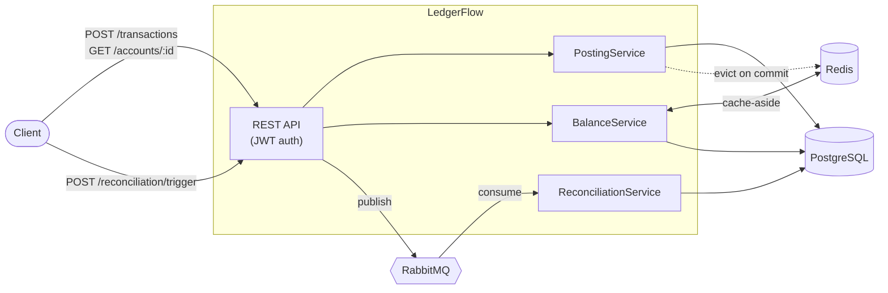

# LedgerFlow

[](https://github.com/labheshwar/ledgerflow/actions/workflows/ci.yml)

A double-entry bookkeeping engine — the same accounting model real banks and payment
processors use, where every transaction is recorded as a balanced pair of entries (a debit
somewhere and a matching credit somewhere else), so the books can never silently drift out of
balance. It's a single Spring Boot service built around one core invariant: **for any
transaction, the sum of its debits must equal the sum of its credits**, enforced in code
before anything is written to the database.

## Why this exists

Ledgers sit at the center of every payment platform, but most day-to-day backend work around
them (onboarding, terminals, payment orchestration) treats the ledger as a black box you write
to, not something you build yourself. LedgerFlow opens that box: it implements the four things
that make a ledger trustworthy under real-world conditions — balanced postings, safe retries,
a reconciliation process against an external source of truth, and a permanent audit trail.

## Core features

- **Balanced posting** — every transaction is submitted as a set of entries; the service
  rejects anything where debits and credits don't sum to zero, inside a single database
  transaction, so a failure midway never leaves a half-posted entry behind.
- **Idempotent by design** — every posting carries a client-supplied idempotency key. A
  retried request (client timeout, dropped connection) is recognized and returns the original
  result instead of posting twice — including the case where two requests with the same key
  race each other.
- **Cached balance reads** — account balances are cached in Redis (cache-aside), invalidated
  the instant a posting touches that account, so the fast read path never risks serving stale
  data.
- **Asynchronous reconciliation** — triggering a reconciliation queues a message on RabbitMQ
  and returns immediately; a separate worker compares the ledger against a simulated external
  statement feed, records per-account matches/mismatches, and marks the batch complete or
  failed, with retry and dead-letter handling if the worker dies mid-run.
- **Concurrency safety** — every account carries an optimistic-lock version column, so two
  postings racing to update the same account can't silently clobber each other's balance.
- **Append-only audit trail** — every posting and reconciliation result appends a row to an
  audit log with before/after snapshots. Nothing is ever overwritten; the database itself
  rejects `UPDATE`/`DELETE` on that table.

## Architecture



Two paths through one service: a **synchronous** path (JWT-authenticated REST → service layer
→ JPA → PostgreSQL, with Redis alongside for balance caching) for posting and reading, and an
**asynchronous** path (service → RabbitMQ → a dedicated worker → PostgreSQL) for reconciliation,
which shouldn't block a caller. JWT auth carries a role claim distinguishing `ADMIN` (can post,
can trigger reconciliation) from `VIEWER` (read-only).

**Stack**: Java 17, Spring Boot 3.5, PostgreSQL + Spring Data JPA, Flyway (versioned schema
migrations), Redis, RabbitMQ, JWT (jjwt), Docker Compose, JUnit + Mockito for unit tests,
Testcontainers for integration tests against real Postgres/Redis/RabbitMQ.

## Getting started

```bash
git clone https://github.com/labheshwar/ledgerflow.git
cd ledgerflow
cp .env.example .env
docker compose up -d --build
```

This brings up Postgres, Redis, RabbitMQ, and the app itself, waits for each dependency to be
healthy before starting the app, and applies the Flyway migrations (including two seeded demo
users and three demo accounts) on first boot. The app is then available at
`http://localhost:8080`.

### Demo credentials

| Username | Password    | Role   |
|----------|-------------|--------|
| `admin`  | `admin123`  | ADMIN  |
| `viewer` | `viewer123` | VIEWER |

### Demo accounts

| ID | Name                 |
|----|----------------------|
| 1  | Cash                 |
| 2  | Accounts Receivable  |
| 3  | Revenue              |

## API walkthrough

Log in and grab a token:

```bash
TOKEN=$(curl -s -X POST http://localhost:8080/auth/login \
  -H "Content-Type: application/json" \
  -d '{"username":"admin","password":"admin123"}' \
  | sed -E 's/.*"token":"([^"]+)".*/\1/')
```

Post a balanced transaction (debit Cash, credit Revenue):

```bash
curl -s -X POST http://localhost:8080/transactions \
  -H "Authorization: Bearer $TOKEN" -H "Content-Type: application/json" \
  -d '{
    "idempotencyKey": "demo-1",
    "description": "cash sale",
    "entries": [
      {"accountId": 1, "entryType": "DEBIT",  "amount": 100.00},
      {"accountId": 3, "entryType": "CREDIT", "amount": 100.00}
    ]
  }'
```

Retrying the exact same request (same `idempotencyKey`) returns the original transaction
instead of posting again. An unbalanced request (debits ≠ credits) gets a `400` instead.

Read the balance back (served from Redis after the first read):

```bash
curl -s http://localhost:8080/accounts/1/balance -H "Authorization: Bearer $TOKEN"
```

Trigger a reconciliation and check its status once it completes:

```bash
BATCH_ID=$(curl -s -X POST http://localhost:8080/reconciliation/trigger \
  -H "Authorization: Bearer $TOKEN" | sed -E 's/.*"id":([0-9]+).*/\1/')

curl -s http://localhost:8080/reconciliation/$BATCH_ID -H "Authorization: Bearer $TOKEN"
```

The trigger call returns immediately (`202 Accepted`, status `PENDING`); the batch flips to
`COMPLETED` shortly after, once the reconciliation worker has consumed the message and recorded
a `MATCHED`/`MISMATCHED` result per account.

## Running tests

```bash
mvn test          # unit tests only (JUnit + Mockito, no external dependencies)
mvn verify         # unit + integration tests (spins up real Postgres/Redis/RabbitMQ via Testcontainers)
```

## Known limitations

This project is honest about where it's simplified, rather than hiding the gaps:

- **No distributed tracing** across the async reconciliation path yet.
- **Cached running total, not full event-sourcing** — account balances are a cached running
  total updated on each posting, rather than always derived by summing entries. A stricter
  design would recompute balances purely from the entry log.
- **No currency conversion** — currency is stored per account, but converting between
  currencies isn't implemented.
- **Single-node Redis and RabbitMQ** — no HA/clustering setup for either.

These are the natural next steps, not oversights being hidden.

## License

[MIT](LICENSE)
